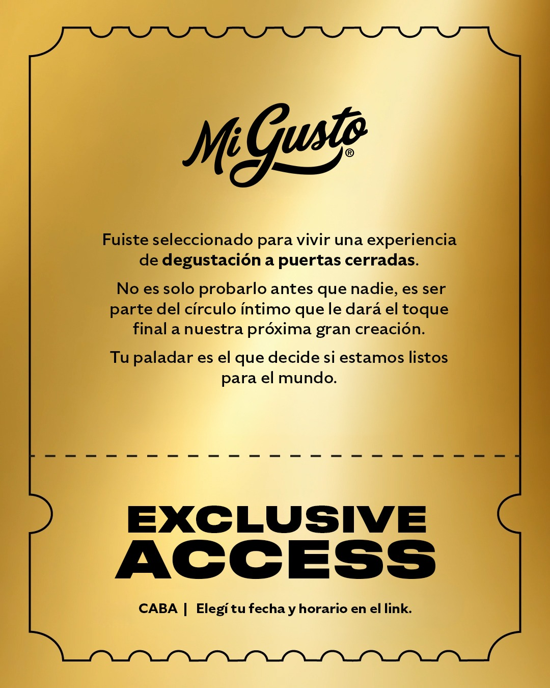

# Mi Gusto - Experiencia de Degustación a Puerta Cerradas

Este es un sistema premium de registro para eventos de degustación exclusiva de la marca **Mi Gusto**. La aplicación está diseñada para ofrecer una experiencia cinematográfica y fluida, gestionando múltiples turnos y horarios con control de cupos en tiempo real.

## 🚀 Características Premium

- **Diseño Boutique**: Estética oscura con acentos en ámbar y piedra, utilizando tipografía moderna y efectos de profundidad.
- **Animaciones Cinematográficas**: Integración de **GSAP** para entradas suaves, revelaciones al scroll y micro-interacciones en botones.
- **Gestión de Cupos en Tiempo Real**: Conexión con **Supabase** para validar la disponibilidad (límite de 7 personas por turno) y deshabilitar opciones agotadas automáticamente.
- **Múltiples Rutas (Virtual Routing)**: Una sola aplicación que maneja 3 flujos distintos de horarios:
  - `/degustacion1`: Turnos de 17:00 a 19:00 hs.
  - `/degustacion2`: Turnos de 19:30 a 21:30 hs.
  - `/degustacion3`: Turnos especiales de Sábado.
- **Persistencia de Estado**: Uso de `localStorage` para recordar si un usuario ya se registró y mostrarle siempre su confirmación.
- **Mobile First**: Optimización total para dispositivos móviles, evitando zooms automáticos y mejorando las áreas de toque.

## 🛠️ Tech Stack

- **Frontend**: React + TypeScript
- **Styling**: Tailwind CSS
- **Animaciones**: GSAP (GreenSock Animation Platform)
- **Base de Datos**: Supabase (PostgreSQL)
- **Iconografía**: Lucide React
- **Build Tool**: Vite

## 👥 Desarrolladores

- **Facundo Carrizo** — GitHub: [@facu14carrizo](https://github.com/facu14carrizo) · LinkedIn: [facu14carrizo](https://www.linkedin.com/in/facu14carrizo)
- **Ramiro Lacci** — GitHub: [@ramirolacci19](https://github.com/ramirolacci19) · LinkedIn: [ramiro-lacci](https://www.linkedin.com/in/ramiro-lacci)

---
Desarrollado con ❤️ para Mi Gusto.
